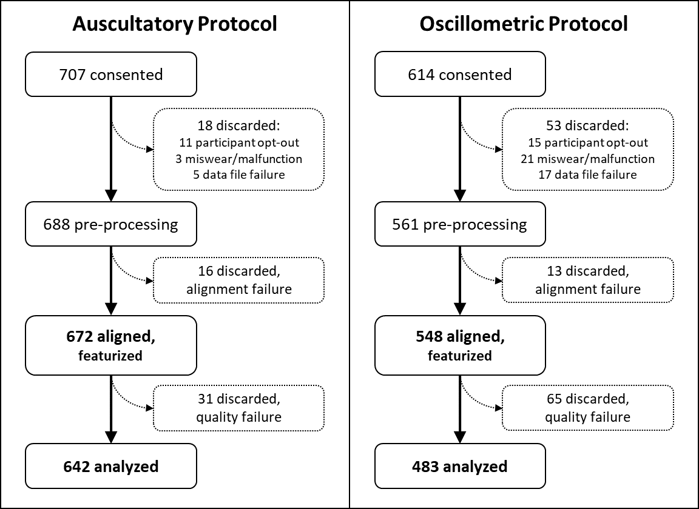
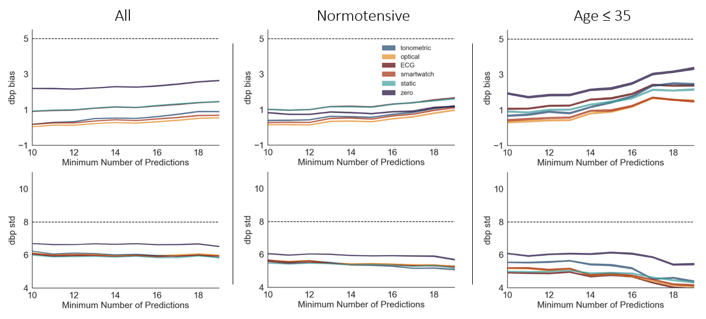

# Data and Protocol Details

## Table of Contents

- [Data File Descriptions](#data-file-descriptions)
- [Protocol Overview](#protocol-overview)
- [Auscultatory Protocol](#auscultatory-protocol)
- [Oscillometric Protocol](#oscillometric-protocol)
- [Supplemental Analyses](#supplemental-analyses)

---

## Data File Descriptions

A small [sample dataset](../sample) is contained in this repository, but the complete de-identified dataset is stored elsewhere. To gain access, any researcher may submit a data access request as described in [Data Access](../README.md#data-access).

### Participant information file

A single file named `participants.tsv` containing study participant information including device sizes, number of included measurements, basic demographics and relevant cardiovascular health history. Each row represents a study participant.

| Column header | Data type | Description |
|:-------------------- |:-------------------- |:-------------------- |
| pid | string | participant ID, prefixed with 'a' for participants in the auscultatory protocol and 'o' for participants in the oscillometric protocol |
| n_meas_inlab | int | number of in-lab measurements from participant available in measurements file |
| n_meas_ambulatory | int | number of ambulatory measurements from participant available in measurements file (applicable to oscillometric protocol only) |
| aurora_size | categorical | tonometric device size, S=small M=medium L=large |
| fitzpatrick_scale | int | Fitzpatrick scale skin color value, standard values 1-7 |
| bp_cuff_arm | categorical | arm wearing BP brachial cuff, L=left arm R=right arm |
| in_feature_table | boolean | denotes whether participant measurements were featurized and available in features.tsv |
| age* | float | age, in years |
| height* | float | height, in inches |
| weight* | float | weight, in pounds |
| gender* | categorical | gender, M=identify male F=identify female |
| self_report_htn* | categorical | participant self-reported hypertensive status: 'norm'= normal or unknown hypertensive status, 'managed'= managed hypertension, 'unmanaged'= unmanaged hypertension |
| high_blood_pressure* | boolean | history of high blood pressure |
| coronary_artery_disease* | boolean | history of coronary artery disease |
| diabetes* | boolean | history of diabetes |
| arrythmia* | boolean | history of arrythmia |
| previous_heart_attack* | boolean | history of previous heart attack |
| previous_stroke* | boolean | history of previous stroke |
| heart_failure* | boolean | history of heart failure |
| aortic_stenosis* | boolean | history of aortic stenosis |
| valvular_heart_disease* | boolean | history of valvular heart disease |
| other_cv_diseases* | boolean | history of other, unlisted cardiovascular disease |
| cvd_meds* | boolean | currently taking any medications for cardiovascular diseases, including high blood pressure |

Notes:

- \* Participant self-reported information
- For boolean values 1=yes, 0=no

### Measurement-level data files

There are two files containing high-level measurement-level data, one for each protocol: `measurements_auscultatory.tsv` and `measurements_oscillometric.tsv`. These files detail basic measurement information including protocol phase, measurement type, measurement characteristics, and file path of the associated waveform files. Each row represents one measurement.

A [file containing waveform-level data](#measurement-waveform-level-data-files) is also available for each measurement, and is referenced using the `waveform_file_path` column.

| Column header | Data type | Description |
|:-------------------- |:-------------------- |:-------------------- |
| pid | string | participant ID, prefixed with 'a' for participants in the auscultatory protocol and 'o' for participants in the oscillometric protocol |
| phase | string | protocol phase for measurement: 'initial' for initial visit, 'ambulatory' for the ambulatory portion of oscillometric protocol, 'return' for return visit', and 'synthetic' for synthetic harmonization of initial visit data for use as a baseline measurement |
| measurement | string | measurement identifier unique within a single pid/phase combination |
| date_time | string | date/time formatted as "%y-%m-%d %H:%M:%S" per the [Python datetime Data Type](https://docs.python.org/3/library/datetime.html) (absolute date information was removed during de-identification, but date relative to the initial visit has been preserved) |
| sbp | float | systolic blood pressure (average of primary and secondary observer determinations in auscultatory protocol, automated device determination value in the oscillometric protocol) |
| dbp | float | diastolic blood pressure (average of primary and secondary observer determinations in auscultatory protocol, automated device determination value in the oscillometric protocol) |
| duration | float | measurement duration, in seconds |
| pressure_quality | float | tonometric quality, 0 to 1 scale |
| optical_quality | float | optical quality, 0 to 1 scale |
| waveform_file_path | string | measurement waveform file path |
| waveforms_generated | boolean | specifies if waveforms were generated from the measurement, 1=yes, 0=no |
| primary_systolic&dagger; | float | primary observer systolic blood pressure determination, in mmHg |
| primary_diastolic&dagger; | float | secondary observer systolic blood pressure determination, in mmHg |
| secondary_systolic&dagger; | float | primary observer diastolic blood pressure determination, in mmHg |
| secondary_diastolic&dagger; | float | secondary observer systolic blood pressure determination, in mmHg |
| consensus_systolic_error&dagger; | float | delta between primary and secondary observer systolic blood pressure determinations, in mmHg |
| consensus_diastolic_error&dagger; | float | delta between primary and secondary observer diastolic blood pressure determinations, in mmHg |

Notes:

- &dagger; Auscultatory protocol only

### Measurement waveform-level data files

Time-aligned sensor waveform data from multiple sensors are provided in individual files for each measurement. These are organized in directories first by protocol and then by participant ID (`pid`). Within these directories, each measurement will have a TSV file named `<pid>.<phase>.<measurement>.tsv`, in which `<pid>`, `<phase>`, and `<measurement>` correspond to the column values from the [meaurement-level data files](#measurement-level-data-files).

For example, the waveforms associated with participant "a1234" from the auscultatory protocol would be in the `measurements_auscultatory/a1234/` directory. The waveforms associated with the "Calibration start 1" measurement from the initial visit would be located in the `measurements_auscultatory/a1234/a1234.initial.Calibration_start_1.tsv` file.

Within these waveform files, each row represents a sample (point in time). Multiple sensor streams are present in each file, and all sensor streams have been resampled to a common timebase of 500 samples per second.

| Column header | Data type | Description |
|:-------------------- |:-------------------- |:-------------------- |
| t | float | time (sec) relative to the date_time metadata value |
| ekg | float | ECG signal amplitude, in millivolts (mV) |
| optical | float | optical signal amplitude, in arbitrary amplifier units |
| pressure | float | tonometric signal amplitude, in millibars (mbar) |
| accel_x | float | acceleration in the X-axis (tonometer band lengthwise plane), in [g-force](https://en.wikipedia.org/wiki/G-force) |
| accel_y | float | acceleration in the Y-axis (tonometer band widthwise plane), in [g-force](https://en.wikipedia.org/wiki/G-force) |
| accel_z | float | acceleration in the Z-axis (perpendicular to tonometer band), in [g-force](https://en.wikipedia.org/wiki/G-force) |

### Measurement features data file

A single file named `features.tsv` containing all derived/calculated features as columns for each featurized measurement. Each row represents one measurement.

| Column header | Data type | Description | Source feature is derived from |
|:-------------------- |:-------------------- |:-------------------- |:-------------------- |
| pid | string | participant ID, prefixed with 'a' for participants in the auscultatory protocol and 'o' for participants in the oscillometric protocol | NA |
| phase | string | protocol phase for measurement: 'initial' for initial visit, 'ambulatory' for the ambulatory portion of oscillometric protocol, 'return' for return visit', and 'synthetic' for synthetic harmonization of initial visit data for use as a baseline measurement | NA |
| measurement | string | measurement identifier unique within a single pid/phase combination | NA |
| date_time | datetime | date/time formatted as "%y-%m-%d %H:%M:%S" per the [Python datetime Data Type](https://docs.python.org/3/library/datetime.html) (absolute date information was removed during de-identification, but date relative to the initial visit has been preserved) | NA |
| sbp | float | systolic blood pressure (average of primary and secondary observer determinations in auscultatory protocol, automated device determination value in the oscillometric protocol) | BP device |
| dbp | float | diastolic blood pressure (average of primary and secondary observer determinations in auscultatory protocol, automated device determination value in the oscillometric protocol) | BP device |
| baseline_sbp | float | baseline systolic blood pressure (calculated as synthetic-Calibration average values), in mmHg  | BP device |
| baseline_dbp | float | baseline diastolic blood pressure (calculated as synthetic-Calibration average values), in mmHg  | BP device |
| delta_sbp | float | delta between sbp and baseline_sbp, in mmHg  | BP device |
| delta_dbp | float | delta between dbp and baseline_dbp, in mmHg  | BP device |
| arm_angle | float | arm angle, in degrees relative to earth's gravity  | accelerometer |
| motion_level | float | motion level  | accelerometer |
| steps_last_five_mins | float | number of steps in the last 5 minutes  | accelerometer |
| steps_last_thirty_mins | float | number of steps in the last 30 minutes  | accelerometer |
| beat_length_ekg | float | heart beat length, in seconds  | ECG |
| hr_ekg | float | heart rate, in bpm  | ECG |
| hrv_ekg | float | heart rate variability, in bpm  | ECG |
| dpdt_optical | float | time derivative of PPG signal  | PPG |
| hr_optical | float | heart rate, in bpm  | PPG |
| quality_optical | float | optical quality, ranges between 0 and 1 (inclusion threshold of .65 was used for prediction experiments in the Aurora-BP study) | PPG |
| invpat_optical | float | inverse rPAT, in 1/seconds  | PPG + ECG |
| rpat_optical | float | rPAT, in seconds  | PPG + ECG |
| aix_pressure | float | augmentation index  | tonometer |
| dicrotic_notch_height_pressure | float | dicrotic notch height, in mbar | tonometer |
| dpdt_pressure | float | time derivative of pressure signal, in mbar/s  | tonometer |
| ejection_duration_fraction_pressure | float | ejection duration fraction  | tonometer |
| ejection_duration_pressure | float | ejection duration, in seconds  | tonometer |
| hr_pressure | float | heart rate, in bpm  | tonometer |
| quality_pressure | float | tonometric quality, ranges between 0 and 1 (inclusion threshold of .65 was used for prediction experiments in the Aurora-BP study) | tonometer |
| rwat_pressure | float | reflected wave arrival time, in seconds  | tonometer |
| sysrise_pressure | float | systolic rise time, in seconds  | tonometer |
| invpat_pressure | float | inverse rPAT, in 1/seconds  | tonometer + ECG |
| rpat_pressure | float | rPAT, in seconds  | tonometer + ECG |
| delta_arm_angle | float | delta between measurement arm angle value and baseline&Dagger; value, in degrees relative to gravity | accelerometer |
| delta_beat_length_ekg | float | delta between measurement heart beat length value and baseline&Dagger; value, in seconds | ECG |
| delta_hr_ekg | float | delta between measurement heart rate value and baseline&Dagger; value, in bpm | ECG |
| delta_hrv_ekg | float | delta between measurement heart rate variability value and baseline&Dagger; value, in bpm | ECG |
| delta_dpdt_optical | float | delta between measurement dP/dt value and baseline&Dagger; value | PPG |
| delta_hr_optical | float | delta between measurement heart rate value and baseline&Dagger; value, in bpm | PPG |
| delta_quality_optical | float | delta between measurement optical quality and baseline&Dagger; value | PPG |
| delta_invpat_optical | float | delta between measurement inverse rPAT value and baseline&Dagger; valu, in secondse | PPG + ECG |
| delta_rpat_optical | float | delta between measurement rPAT value and baseline&Dagger; value, in seconds | PPG + ECG |
| delta_aix_pressure | float | delta between measurement augmentation index and baseline&Dagger; value | tonometer |
| delta_dicrotic_notch_height_pressure | float | delta between measurement dicrotic notch height value and baseline&Dagger; value, in mbar | tonometer |
| delta_dpdt_pressure | float | delta between measurement dP/dt value and baseline&Dagger; value, in mbar/s | tonometer |
| delta_ejection_duration_fraction_pressure | float | delta between measurement ejection duration fraction value and baseline&Dagger; value | tonometer |
| delta_ejection_duration_pressure | float | delta between measurement ejection duration value and baseline&Dagger; value, in seconds | tonometer |
| delta_hr_pressure | float | delta between measurement heart rate value and baseline&Dagger; value, in bpm | tonometer |
| delta_quality_pressure | float | delta between measurement tonometric quality and baseline&Dagger; value | tonometer |
| delta_rwat_pressure | float | delta between measurement reflected wave arrival time value and baseline&Dagger; value, in seconds | tonometer |
| delta_sysrise_pressure | float | delta between measurement systolic rise time and baseline&Dagger; value, in seconds | tonometer |
| delta_invpat_pressure | float | delta between measurement inverse rPAT value and baseline&Dagger; value, in 1/seconds | tonometer + ECG |
| delta_rpat_pressure | float | delta between measurement rPAT value and baseline&Dagger; value, in seconds | tonometer + ECG |

Notes:

- &Dagger; *Calibration average values* feature row of specified participant
- See original publication for discussion on feature derivation methods

---

### Synthetic Measurements

In order to standardize analysis across auscultatory and oscillometric protocols as well as within participant sets, a series of harmonized “synthetic” phase measurements were derived from initial visit data. These synthetic measurements only appear in the `features.tsv` file, and do not have any associated waveform files or associated rows in the measurements TSV files. The two types of harmonization performed were (1) to optimize for a consistent BP value baseline, and (2) to optimize for a baseline with the most available tonometric signal.

These were calculated for initial supine measurements and, when available, initial seated measurements. Initial calibration measurements were averaged to create the "Calibration average values" baseline reported in "baseline_sbp" and "baseline_dbp"; these baselines were used in calculating "delta_" features for each participant.

---

## Protocol Overview

Institutional review board (IRB) approval for this study was obtained from WCG IRB (Puyallup, WA, USA). Individuals unable to consent in English, pregnant women, prisoners, institutionalized individuals, and individuals younger than 18 were excluded from participation due to their vulnerable status. In support of the overall goal of assessing the clinical feasibility of multiple cuffless BP techniques, subject recruitment intentionally targeted a heterogeneous pool of individuals. Participants were selected to balance across gender and self-reported hypertensive status.

Two separate protocols were performed---**auscultatory** and **oscillometric**---each using a different clinically-validated BP measurement technique. These protocols were non-concurrent, with each individual participant included in only a single protocol. In both protocols, a series of measurements were collected in two controlled in-lab visits at least 24 hours apart. During the oscillometric protocol, ambulatory measurements were also collected during the time between the in-lab visits. Ambulatory measurements were not feasible in the auscultatory protocol. Post-exercise measurements were collected in both protocols, but were not included in post-featurization analysis.

In both protocols, participants were fitted with three devices: a cuff-based, clinically-validated BP measurement device, a tonometric sensing device, and an optical sensing device. The tonometric device was worn on the wrist and fitted with a pressure sensor to measure the pulse pressure waveform at the radial artery. An extender could be used to adjust for participant comfort or signal strength of the tonometer. The optical sensing device was worn proximal to the tonometric sensing device. The optical sensing device used a standard PPG sensor placed on the anterior surface of the arm. Additionally, both devices had an ECG sensor (ADS1292) used to measure cardiac electrical activity and to time-align measurements across devices, with electrodes applied to measure Lead I ECG. The BP cuff was worn on the opposite arm as the tonometric and optical devices. BP cuff size was determined by measuring the upper arm circumference and selecting a cuff according to manufacturer specifications. Additional details regarding the tonometric and optical devices are provided below.

### Tonometric Sensing Device

The wrist-worn design of the tonometric device enables non-experts to properly place the sensor and capture high quality radial pulse pressure waves. The electronics in the tonometric device are distributed around the wrist to improve comfort with long-term wear, and a force concentrator is used over the pressure sensor (MS5803-02BA) to maximize signal quality. ECG sensing is provided via two exposed stainless steel bumps on the inner wrist (dry contacts) and a connection point for a standard wet electrode. The wet electrode wire is run up the participant's arm and connected to the chest on the opposite side of the heart. An accelerometer (LSM6DS3) is used to monitor arm posture and activity level.

Sensor Type | Part Number | Sampling Rate
----------- | ----------- | -------------
Pressure/Tonometer | [MS5803-02BA](https://www.te.com/commerce/DocumentDelivery/DDEController?Action=srchrtrv&DocNm=MS5803-02BA&DocType=Data+Sheet&DocLang=English) | 200 S/s
ECG         | [ADS1292](https://www.ti.com/product/ADS1292) | 488.28 S/s
Accelerometer | [LSM6DS3](https://www.st.com/en/mems-and-sensors/lsm6ds3tr-c.html) | 100 S/s

### Optical Sensing Device

The optical device resembles a large smart watch and records ECG and PPG signals. It incorporates a commercial PPG optical sensor (MAX30101) that sits underneath the watch body. The only LED used in the collection of PPG signals was the green LED, which has a nominal wavelength peak of between 527 nm and 537 nm depending on ambient conditions. The three ECG contacts are made via standard wet electrodes with two electrodes connected on the same arm as the device, and the third connected to the chest on the opposite side of the heart.  An accelerometer (LSM330) is used to monitor arm posture and activity level.

Sensor Type | Part Number | Sampling Rate
----------- | ----------- | -------------
Optical/PPG | [MAX30101](https://www.maximintegrated.com/en/products/interface/signal-integrity/MAX30101.html) | 250 S/s
ECG         | [ADS1292](https://www.ti.com/product/ADS1292) | 498.67 S/s
Accelerometer | [LSM330](https://media.digikey.com/pdf/Data%20Sheets/ST%20Microelectronics%20PDFS/LSM330.pdf) | 100 S/s

## Auscultatory Protocol

The auscultatory protocol aimed to collect and analyze radial pulse waveform information at two time points at least 24 hours apart. These sensor data were synchronized with simultaneous manual auscultatory BP measurements. The first visit consisted of device fitting and setup, postural, and post-exercise data collection. The second visit would occur the following day, at least 24 hours later, and would involve postural data collection and participant feedback.

### Auscultatory Device Setup

Auscultatory measurements were performed by trained expert observers using a dual-head stethoscope for paired auscultation BP measurements using the ADC Diagnostix 700/703 aneroid sphygmomanometer. In extenuating circumstances, single-observer auscultation was performed. During paired auscultation, observers were blinded to each other's measurement determinations until the end of the visit. The brachial cuff was fitted to the participant's left or right arm (randomized). Cuff inflation and deflation were manually controlled by one of the observers.

### Auscultatory Initial Visit Measurements

Following equipment fitting and a ten-minute supine rest period, a series of manual BP measurements were taken with at least 60 seconds between each measurement and a five-minute rest in-position for each postural change. Measurements were taken for supine and seated postures, with arms resting on an adjustable table at the participant's heart height for the seated posture.

Two post-exercise measurements were collected following postural measurements, with three minutes of rest between each. Participants were instructed to pedal a recumbent stationary exercise bike for two minutes at a comfortable "jogging" pace and then immediately rest arms by their sides. BP was measured when the participant's heart rate (HR) reached a target HR defined to be an increase from resting HR of either 20 bpm or 20%, whichever was higher (e.g., for a resting HR of 65 bpm, use target of 85 bpm rather than 78 bpm).

### Auscultatory Return Visit Measurements

The return visit consisted of collection of feedback and a second series of supine and seated postural measurements equivalent to the initial visit.

### Auscultatory Measurements Overview

## Oscillometric Protocol

The oscillometric protocol aimed to collect and analyze ambulatory radial pulse waveform information over a period of at least 24 hours. These sensor data were synchronized with automated oscillometric BP measurements that occurred during the same time window. The protocol was executed in two visits at least 24 hours apart, with ambulatory measurements recorded in the time between visits. The first visit consisted of device fitting and setup, postural data collection, post-exercise data collection, and participant instruction for device use during the ambulatory phase between visits. The second visit would occur the following day, at least 24 hours later, and would involve seated posture data collection and participant feedback.

### Oscillometric Device Setup

Blood pressure was measured using the Spacelabs Healthcare OnTrak 90227 ambulatory BP monitor ("ABPM device"). The brachial cuff was fitted to the participant's dominant arm or according to the participant's preference. Cuff inflation and deflation were automatically controlled by the ABPM device. The tonometric device can be adjusted to multiple tightness levels. While tighter settings generally provide high-quality pressure waveforms, they are also less comfortable for long-term wear. Therefore, 3 band tightness levels were determined for each participant and marked on the band:

- daytime measurement tightness
- daytime tightness between measurements (one notch looser than daytime measurement tightness)
- nighttime tightness (approximately two notches looser than daytime measurement tightness)

### Oscillometric Initial Visit Measurements

Following equipment fitting and a ten-minute seated rest period, a series of operator-initiated blood pressure measurements were taken at least 60 seconds between each measurement and a five-minute rest in-position for each postural change. The participant would tighten the tonometric device to the “daytime measurement tightness” during measurements and loosen the device following measurements. Measurements were taken for the following postures:

Measurement Name    | Posture | BP-Cuff Arm Position  | Tonometric and Pressure Device Arm Position
------------------- | ------- | --------------------- | --------------------------------------------
Sitting arm down    | Seated  | Hanging along side of body | Hanging along side of body
Sitting arm lap     | Seated  | Hand in lap           | Hand in lap
Sitting arm up      | Seated  | Hand in lap           | Held at heart height
Supine 1            | Supine  | Resting along side of body | Resting along side of body
Supine 2 (repetition) | Supine | Resting along side of body | Resting along side of body
Standing arm down   | Standing | Hanging along side of body | Hanging along side of body
Standing arm up     | Standing | Hanging along side of body | Held at heart height

Four post-exercise measurements were collected following postural measurements. Participants were instructed to pedal a recumbent stationary exercise bike for two minutes at a comfortable "walking" pace and then immediately rest arms on by their sides for an operator-initiated blood pressure measurement. Then participants were instructed to pedal for two minutes at a "running" pace and then immediately rest arms on by their sides for an operator-initiated blood pressure measurement. Two post-running cool down measurements were taken: after three minutes of rest and after 6 minutes of rest. A heart rate target was not used in the oscillometric protocol.

### Oscillometric Ambulatory Phase Measurements

Between the initial visit and the return visit, participants were instructed to wear all of the devices continuously and go through the measurement procedure whenever feasible (i.e., not when driving). BP measurements were triggered automatically every 30 minutes during waking hours (defined as approximately 8AM-8PM) and every 60 minutes at nighttime (defined as approximately 8PM-8AM). These measurement intervals are consistent with recommendations from the European Society of Hypertension.

#### Synchronization of Devices

Synchronizing the measurement timing of the tonometric and optical devices and the ABPM device during the ambulatory phase of the study was challenging, as the ABPM device did not provide any guarantee of when measurements would occur: only that a certain number of measurements would occur during a given time-frame. The ABPM device was regular in the timing of measurements (e.g., if a measurement occurred at 8:17 am, then subsequent measurements would occur at 8:47 am, 9:17 am, etc.), however the offset (x:17 in the case above), was not deterministic and required observation. To accomplish this, the ABPM device was put into automated measurement mode well before the initial visits so this offset could be recorded.

The tonometric and optical devices were then programmed to begin taking each measurement during the ambulatory phase approximately two minutes before this offset, and to continue measuring until two minutes after this offset, ideally recording data during the entire BP measurement. On occasions where the BP measurement was repeated due to measurement failure, and the subsequent measurement succeeded, there is no longer any guarantee that the data collected from the pressure and optical devices was collected during the exact same time period as the BP measurement.

### Oscillometric Return Visit Measurements

The return visit consisted of participant feedback and a second series of automated oscillometric measurements, identical to the initial visit. The participant was asked for feedback and also asked whether they removed any of the devices during the 24-hour ambulatory phase, and if so, they were asked approximately when and for how long. If the participant arrived with any devices removed they were instructed to put them back on. After a 5-minute seated rest period, seated postural measurements were repeated.

### Oscillometric Measurements Overview

---

## Supplemental Analyses

### Varying Minimum Number of Measurements

Comparisons of ECG, optical, and tonometric feature group performance against smart watch, static, and zero baselines are shown below for systolic BP (SBP) and diastolic BP (DBP). Both bias and standard deviation in BP estimation are reported across a range of minimum number of measurements available for participants in each subset. A lower minimum number of measurements was the most inclusive of participants with fewer usable measurements and a higher minimum was more stringent.

SBP prediction results after 24-hour wear. Shaded regions indicate 95% confidence bound values calculated via bootstrapping. All feature groups fall below 5 mmHg bias, but only achieve < 8 mmHg standard deviation for normotensive and young subpopulations. The tonometric estimates exhibit a lower standard deviation than other feature groups overall and among normotensives.

DBP prediction results after 24-hour wear. Shaded regions indicate 95% confidence bounds. As with SBP, all feature groups exhibit a bias < 5 mmHg. All feature groups also achieve a standard deviation < 8 mmHg, although the zero baseline performs worse than the other feature groups and tonometric performs better overall and on normotensives than on the young subpopulation.

### Error by Time of Day

Bias and standard deviation of SBP prediction were evaluated by time of day for both the tonometric and optical feature groups. Given our sinusoidal time feature, the bias takes on a similarly sinusoidal shape; however, the values still remain < 5 mmHg throughout daytime and nighttime hours. Standard deviation of prediction exhibits little change, but is observed to decrease slightly during daytime hours for both feature groups.

Tonometric feature group

Optical feature group

